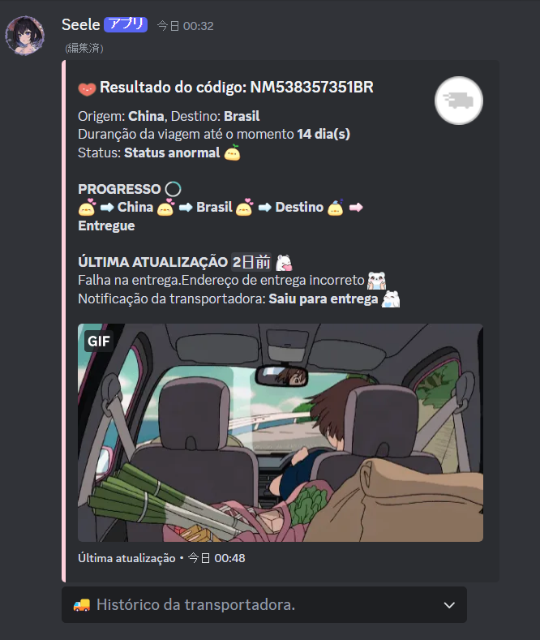
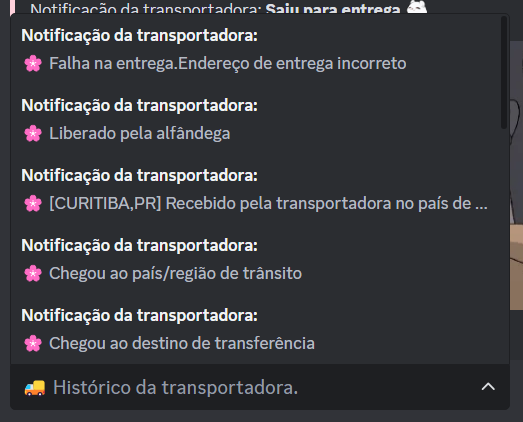
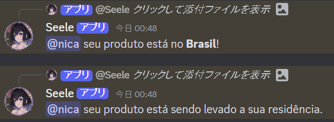

<div align="center"></img></div>

# Madoka ˚˖𓍢ִ໋🌷͙֒✧˚.🎀༘⋆
* Madoka era um projeto que eu fiz e usei uma vez para acompanhar o meu pedido da Aliexpress.
* O projeto estava guardado e resolvi da uma melhorada para disponilizar para quem queira usar.
* Caso queira acompanhar códigos dos **Correios** ou vários códigos de rastreio ao mesmo tempo eu recomendo usar esse projeto -> **[correios-discord-bot](https://github.com/vergonha/correios-discord-bot)**

# 「 ✦ Configurações ✦ 」
* Clone esse reposítorio e preencha os dados no arquivo **util > constants**<br>
-- code - Código do seu rastreio (Apenas produtos da Aliexpress)<br>
-- mentionId - Id da sua conta;<br>
-- channelId - Id do canal a onde a embed e mensagens será enviadas;<br>
-- messageId - Mensagem do bot que será editada com as informações (Na primeira inicialização deixe vazio)<br>

* Os emojis e a imagem da embed estão na pasta **assets**

# 「 ✦ Aviso ✦ 」
```
O campo "Data para o produto ser entregue" foi removido pq eu não tenho código de rastreio para testar.
```
# 「 ✦ Imagens ✦ 」
<div align="center"></img></div>
<div align="center"></img></div>
<div align="center"></img></div>